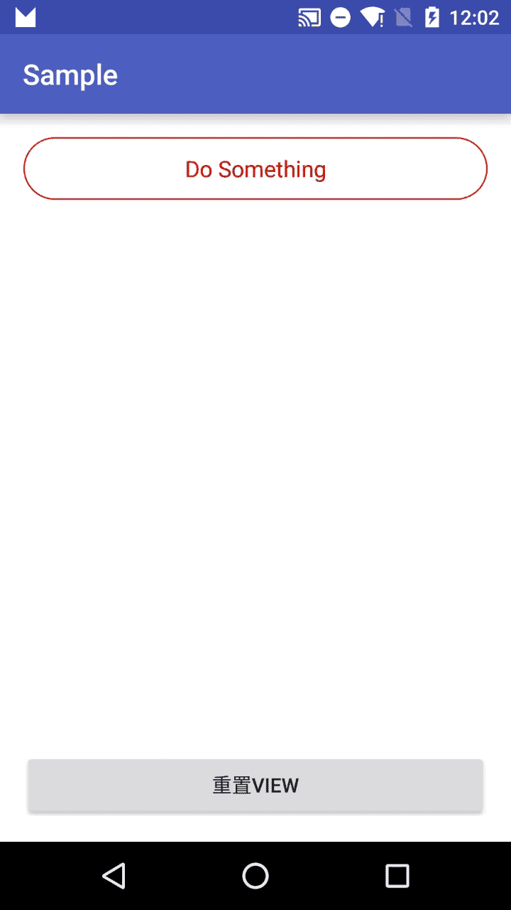

#RectCircleProgressButton


前段时间工作需要用到一个按钮的效果，但是简单做了一下，最近闲下来一点整理了一下，代码略乱，欢迎各种类型issue，后续看看再整理吧。



###怎么使用
```
dependencies {
    compile 'com.clownqiang:RectCircleProgressButton:1.0.1'
}
```

```
<com.clownqiang.rectcircleprogressbutton.RectCircleProgressButton
        android:id="@+id/btn_rect_circle"
        android:layout_width="match_parent"
        android:layout_height="45dp"
        app:rcpb_circle_color="@android:color/holo_green_dark"
        app:rcpb_rec_color="@android:color/holo_red_dark"
        app:rcpb_rec_stoke_width="1dp"
        app:rcpb_rec_text="Do Something"
        app:rcpb_rec_text_color="@android:color/holo_red_dark"
        app:rcpb_rec_text_size="16sp"
        app:rcpb_rec_to_circle_color="@android:color/holo_blue_bright"
        app:rcpb_rec_to_circle_interval="700"
        app:rcpb_rotate_speed="30"
        />
```

###配置
```
rcpb_rec_text 按钮显示文字，默认显示Download
rcpb_rec_text_color 文字颜色
rcpb_rec_text_size 文字大小
rcpb_rec_color 矩形状态颜色
rcpb_rec_to_circle_color 矩形变换到圆形动画时颜色
rcpb_circle_color 圆形状态颜色
rcpb_rec_stoke_width 线条宽度
rcpb_rec_to_circle_interval 矩形变换圆形动画时间（ms）
rcpb_rotate_speed 圆形旋转动画时间（ms）
```

可以实现接口AnimationStatusListener：

```
void startLoading(int status); //变为圆形旋转状态，开始加载
void resetView(int status); //reset到矩形状态，停止加载
```

同时方法resetButtonView()用于需要代码主动回退状态。